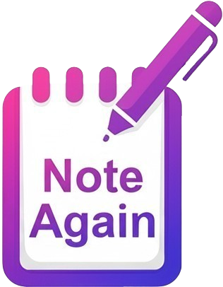

<div align="center">
  

  <p>Write down your ideas and keep track of all your thoughts.</p>

   <br/>

  

  <br/>

  <br/>
</div>

---

# Note Again 📝

**Note Again** is a lightweight, Notion-style note-taking app built with React and Vite. It's designed to help you create, edit, and organize your notes with a smooth, responsive, and modern user experience.

The goal of this personal project is to create a showcase piece for my portfolio.

## Deploy 🚀

👉 [View Live on Vercel](https://note-again-git-main-brachods-projects.vercel.app)

## Features ✨

- Create, edit, and delete notes
- Preview note titles and content
- Real-time search functionality
- Alphabetical sorting (A → Z or Z → A)
- Validation to prevent multiple empty notes
- Responsive layout with collapsible sidebar on mobile
- Dark and light mode toggle
- Notes are saved automatically in the browser

## Built with 🛠️

- **React Js**
- **Vite**
- **Tailwind CSS**
- **LocalStorage**

## Dependencies

- **react-hot-toast**
- **react-icons**
- **sweetalert2**
- **lucide-react**
- **@tailwindcss/line-clamp**
- **@tailwindcss/typography**

## Installation

- Clone repository:
  - git clone https://github.com/BrachoD/note-again.git;
- Change directory to the project root folder:
  - cd note-again
- Install dependencies:
  - npm i
- Compile:
  - npm run dev
- Visit:
  - http://localhost:5173

## Project Structure 📁

```
note-again/
├── components/
│   ├── Editor.jsx
│   ├── Header.jsx
│   ├── NoteList.jsx
│   ├── SearchBar.jsx
│   └── Sidebar.jsx
├── App.jsx
├── main.jsx
├── index.css
└── ...
```

---

## Made by [David Bracho](https://github.com/BrachoD)

This personal project was designed for the sole purpose of showcasing my Front-End development skills.
With a background in Electrical Engineering and over five years of industry experience, I’m now channeling my passion for web development into a new professional direction—transforming what was once a hobby into a meaningful career path.
